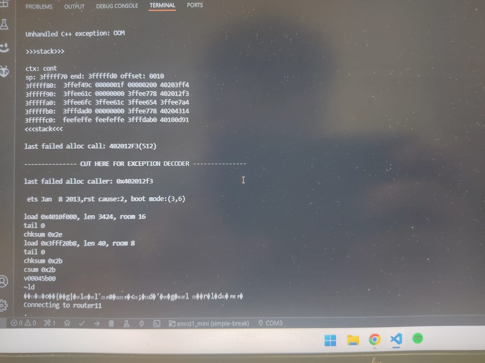
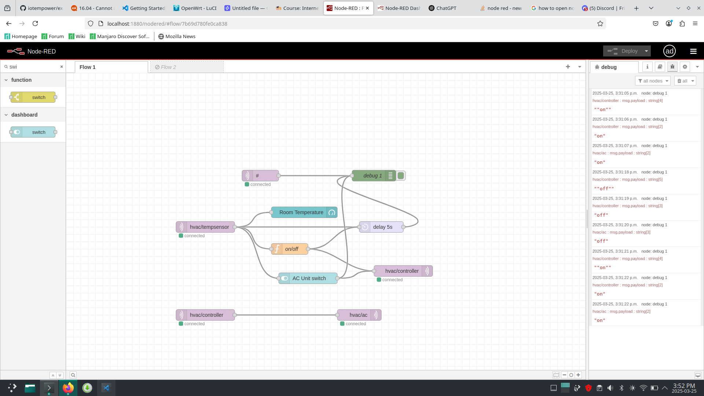
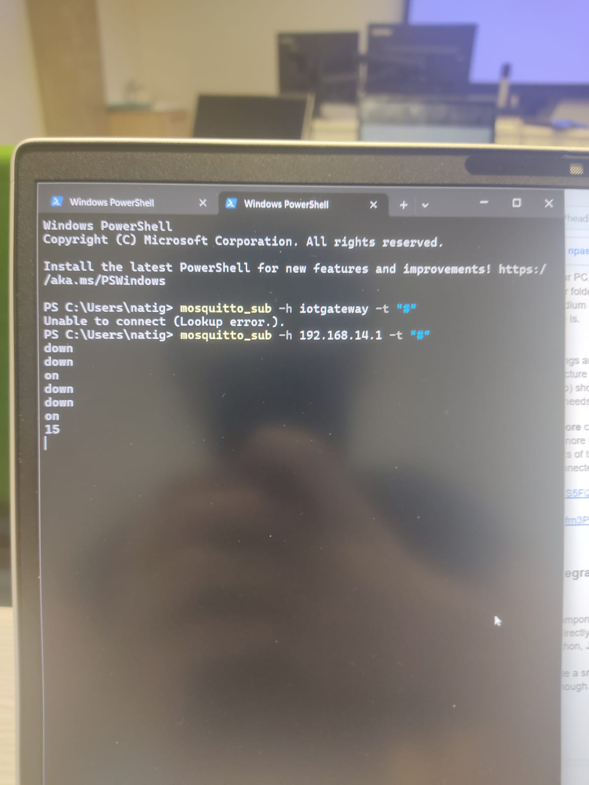
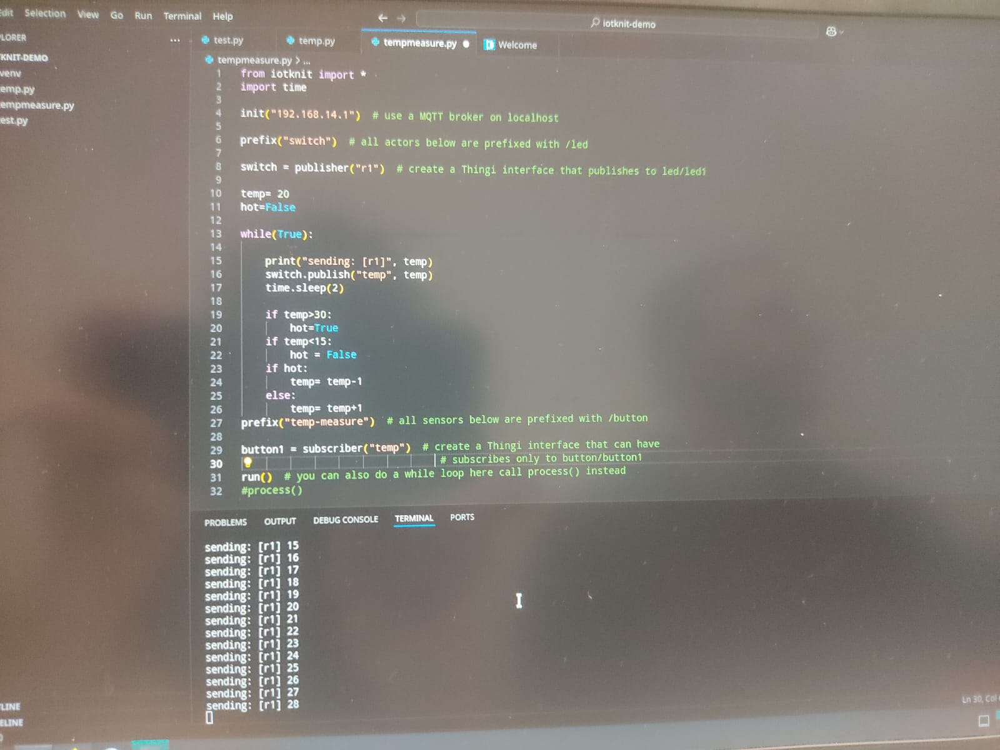
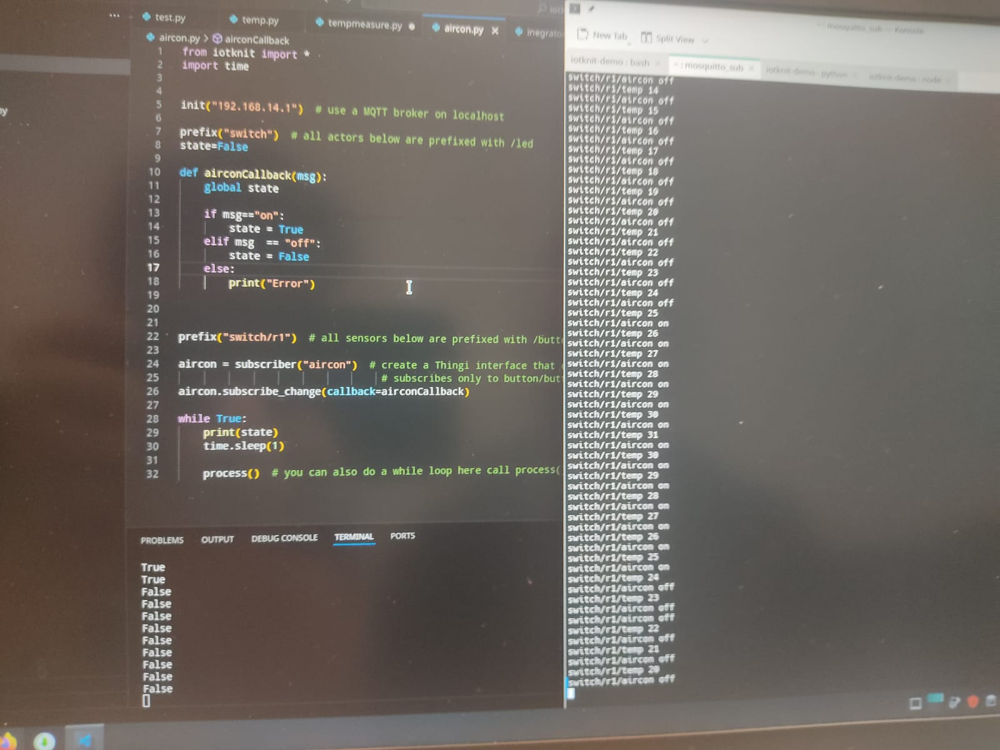
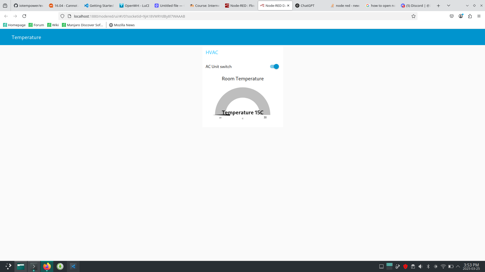
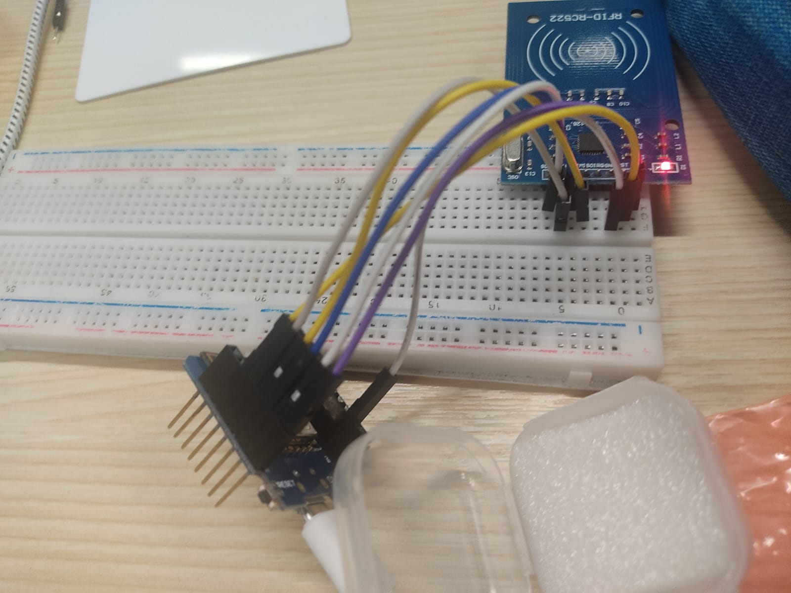
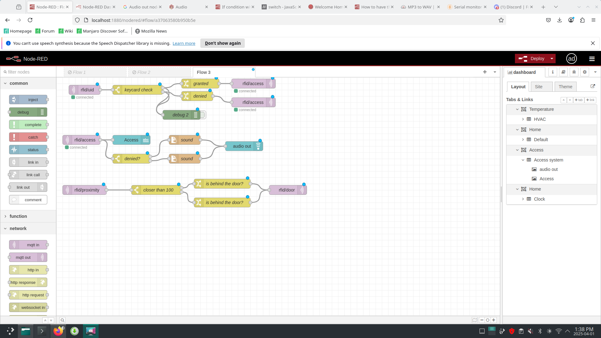
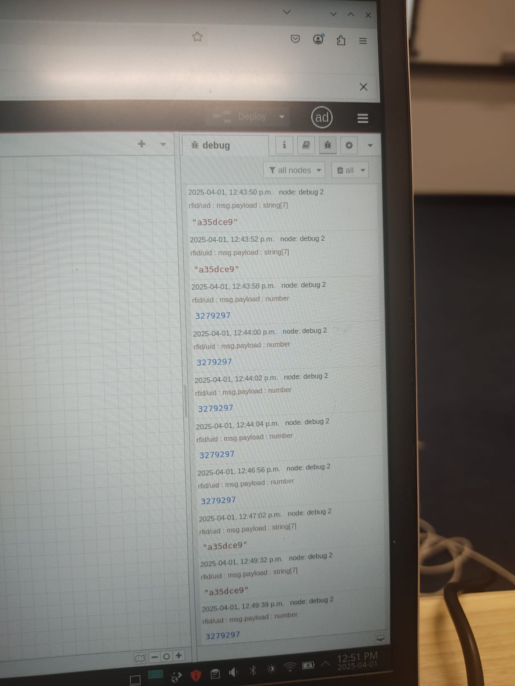
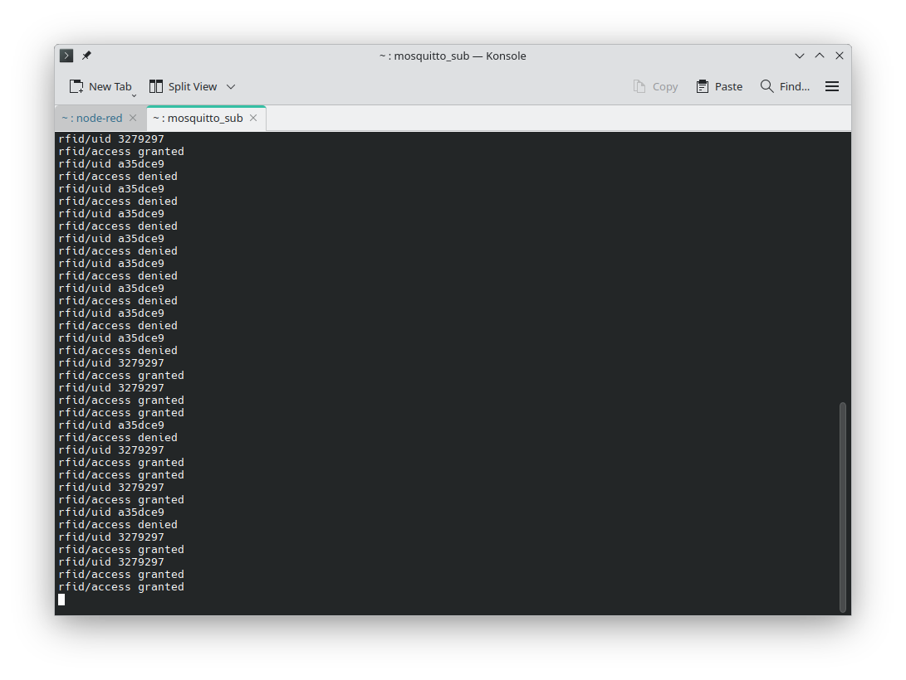

# Module 4

## Demos: Broken code.
### Null pointer segmentation fault
 \
### Memory overflow 
 \
 \
### Multitasking - interrupts and WiFi 
 \

## Mini Project: HVAC system with Integration and Simulators/Mockups
 \
 \
 \
 \ 
 

## Project: Full Access Control system in Node-RED 
 \ 
 \
 \
 
